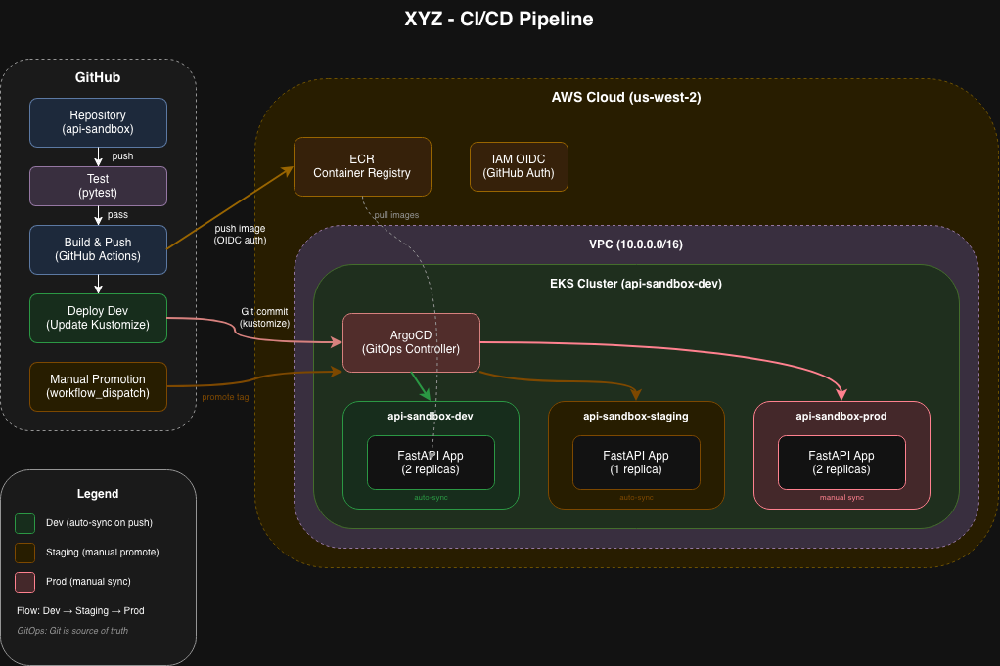
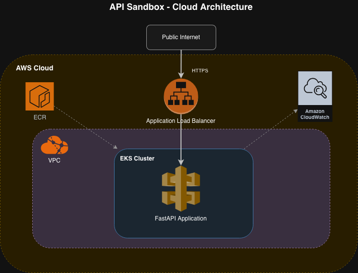

# API Sandbox

A FastAPI application deployed on AWS EKS using Terraform and GitOps (ArgoCD) with multi-environment support.

## Overview
### CICD
 

### Cloud Architecture
 

## Network
 A single VPC (10.0.0.0/16) with public and private subnets across 3 availability zones, where EKS worker nodes run in public subnets (NAT Gateway disabled to save costs) with direct internet access via an     
  Internet Gateway. 

## Environment Strategy

This setup uses a **single-cluster, multi-namespace** approach:

| Environment | Namespace | Auto-Sync | Replicas |
|-------------|-----------|-----------|----------|
| Dev | api-sandbox-dev | Yes | 2 |
| Staging | api-sandbox-staging | Yes | 1 |
| Prod | api-sandbox-prod | No (manual) | 2 |

**Benefits:**
- Fast environment creation (seconds vs 15-20 min for new clusters)
- Cost-effective (~$95/month vs ~$220+ for multi-cluster)
- Consistent by design (same cluster, same base config)

## GitHub Repository Configuration

The Terraform workflow requires this repository variable:

| Variable | Description |
|----------|-------------|
| `TF_STATE_BUCKET` | S3 bucket name for Terraform state |

Set via: **Settings** → **Secrets and variables** → **Actions** → **Variables**

## First Time Setup / Disaster Recovery

### 1. Bootstrap Terraform Backend
Creates S3 bucket for terraform state file and DynamoDB Table.

```bash
./scripts/bootstrap-terraform-backend.sh
```

### 2. Deploy Infrastructure

```bash
cd terraform/environments/shared
terraform init
terraform plan
terraform apply
```

### 3. Configure kubectl

```bash
aws eks update-kubeconfig --region us-west-2 --name api-sandbox-dev
```

### 4. Deploy ArgoCD ApplicationSet

```bash
kubectl apply -f argocd/project.yaml
kubectl apply -f argocd/applicationset.yaml
```

This creates three ArgoCD applications automatically:
- `api-sandbox-dev`
- `api-sandbox-staging`
- `api-sandbox-prod`

### 5. Access ArgoCD UI

```bash
# Port-forward to access locally (recommended)
kubectl port-forward svc/argocd-server -n argocd 8080:80
# Then open http://localhost:8080

# Or get the ArgoCD server URL via LoadBalancer
kubectl get svc -n argocd argocd-server

# Get the initial admin password (username: admin)
kubectl -n argocd get secret argocd-initial-admin-secret -o jsonpath='{.data.password}' | base64 -d
```

### 6. Access the API

```bash
# Get the API URL (ALB hostname)
kubectl get ingress api-sandbox -n api-sandbox-dev -o jsonpath='{.status.loadBalancer.ingress[0].hostname}'

# Test the API
curl http://<ALB_HOSTNAME>/
```

## Promotion Workflow

```
Code Push → Dev → Staging → Prod
              ↓       ↓        ↓
           (auto)  (manual)  (manual)
```

### Automatic: Dev Deployment

Push code to `main` branch → CI builds image → deploys to dev automatically.

### Manual: Promote to Staging/Prod

Use GitHub Actions workflow dispatch:

1. Go to **Actions** → **CI - Build and Promote**
2. Click **Run workflow**
3. Select environment: `staging` or `prod`
4. Click **Run workflow**

Or use GitHub CLI:
```bash
# Promote to staging
gh workflow run ci.yaml -f promote_to=staging

# Promote to prod
gh workflow run ci.yaml -f promote_to=prod
```

## API Endpoint

**GET /**

```json
{
  "message": "Automate all the things!",
  "timestamp": 1529729125
}
```

**GET /health**

Health check endpoint for Kubernetes probes.

## Local Development

```bash
cd app
pip install -r requirements.txt
uvicorn main:app --reload
```

## Cleanup

```bash
./scripts/teardown.sh
```

Or manually:
```bash
cd terraform/environments/shared
terraform destroy
```
